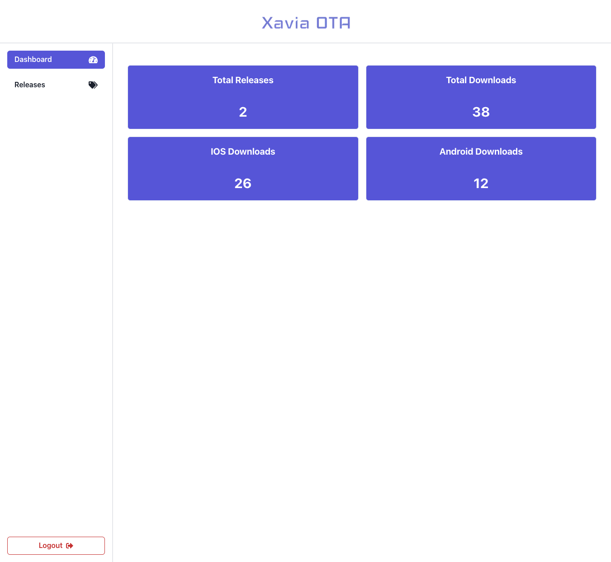
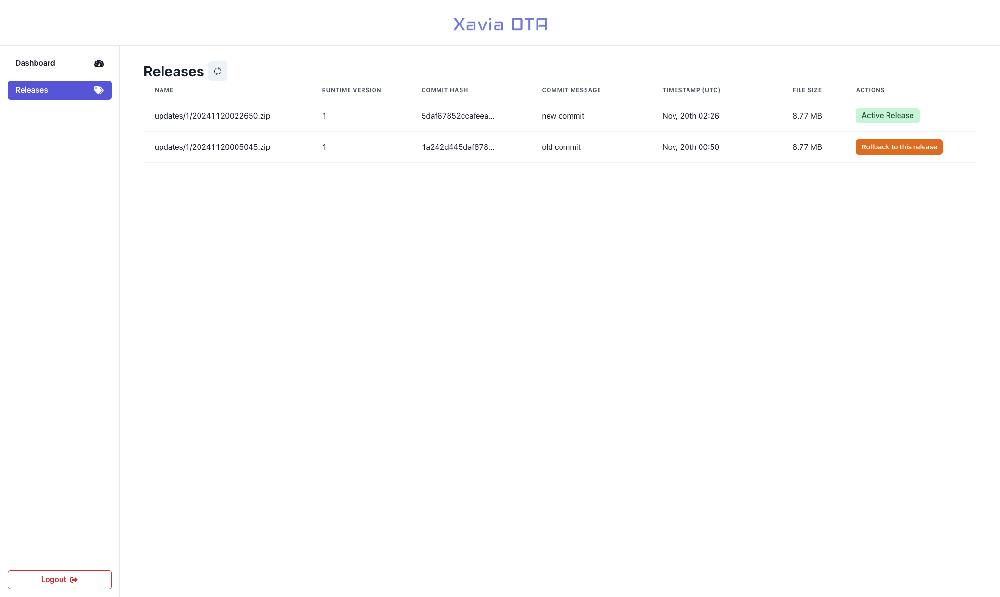

# Admin Portal Documentation

The admin portal provides a web interface for managing your OTA updates. 

## Dashboard Overview

The main dashboard provides:
- Total number of releases
- Total number of downloads for all platforms
- Total number of downloads by platform

## Publishing and Rolling Back Updates

The release page provides:
- List of all releases with metadata
- Rollback functionality to a previous release

